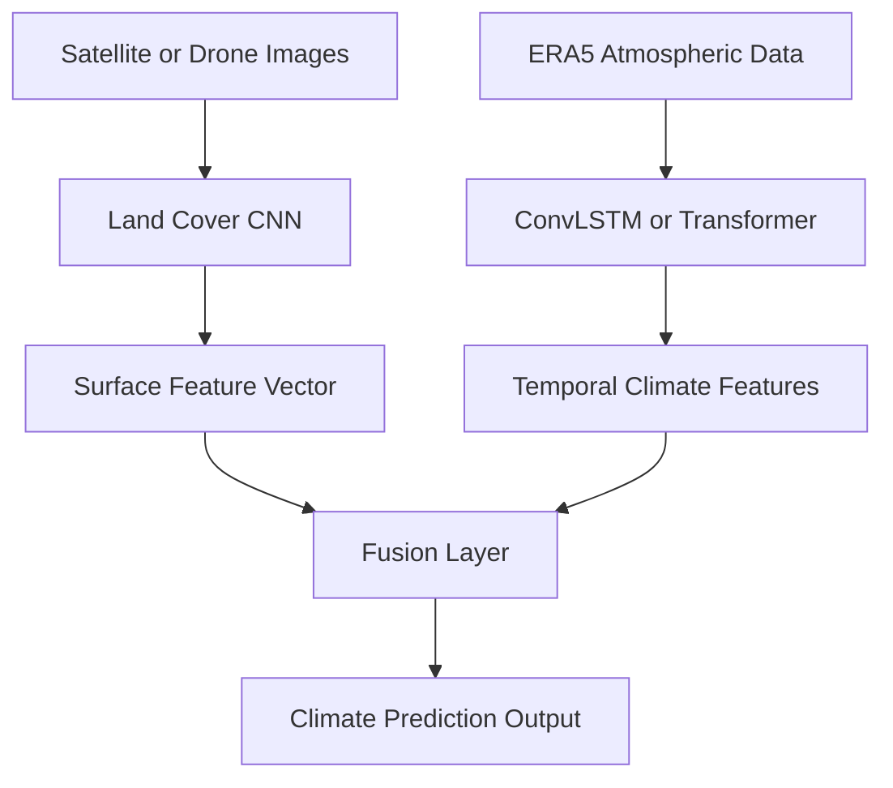

# Robust Earth Forecast

Robust Earth Forecast is a research-oriented deep learning project for climate downscaling, forecasting, and environmental data modeling.

The project focuses on learning spatial and temporal patterns from atmospheric datasets such as ERA5 and using modern neural network architectures to build climate prediction systems. The long-term goal is to study how coarse-resolution climate data can be transformed into more useful high-resolution regional predictions, with a particular focus on downscaling workflows such as ERA5 to PRISM.

This repository is being developed as a structured climate AI project with reproducible data pipelines, deep learning models, evaluation code, and visualization tools.

---

## Research Motivation

Large-scale climate and weather datasets often provide information at coarse spatial resolution.  
For regional analysis and decision-making, these outputs need to be translated into finer spatial detail.

A typical downscaling workflow looks like this:

ERA5 (coarse-resolution climate data)  
↓  
Deep learning model  
↓  
High-resolution regional climate prediction

This project explores how deep learning architectures can be used for that task while also supporting broader climate forecasting experiments.

---

## Current Project Goals

The current goals of the project are:

- build a clean and reproducible ERA5 climate data pipeline
- prepare datasets for climate downscaling experiments
- implement baseline and advanced deep learning models
- evaluate model performance with scientific metrics
- generate climate maps and visualizations
- gradually move toward transformer-based climate architectures inspired by modern foundation models such as Prithvi WxC

---

## Datasets

### ERA5 Reanalysis Data
ERA5 is used as the primary atmospheric dataset in this project. It provides large-scale climate and weather variables and serves as the coarse-resolution source for downscaling experiments.

### PRISM Climate Data
PRISM is intended as the high-resolution target dataset for regional climate downscaling experiments.

### Initial Regional Focus
The first practice task for this project is:

**Downscaling surface temperature for Georgia**

---

## Current Models Implemented

The repository is structured to support multiple model families for climate AI experiments.

### 1. CNN Downscaler
A baseline convolutional neural network for spatial climate downscaling.

Purpose:
- learn a mapping from coarse-resolution climate grids to higher-resolution outputs
- establish a strong baseline before moving to transformer-based models

### 2. ConvLSTM Forecaster
A spatiotemporal model for learning atmospheric dynamics over time.

Purpose:
- model temporal evolution of weather fields
- support future forecasting experiments using sequential climate data

### 3. Transformer Downscaler
A transformer-based model for spatial climate modeling.

Purpose:
- explore patch-based climate representations
- move toward architecture ideas used in modern AI weather models

### 4. Remote Sensing CNN Modules
Earlier project work includes CNN modules for land-cover and remote sensing imagery.

Purpose:
- study how surface information may help environmental prediction
- support future multimodal climate experiments

---

## Model Architecture

The long-term architecture direction of the project combines atmospheric data, temporal learning, and potentially surface information from imagery.

Venkata Vivek Panguluri
M.S. Computer Science
University of Georgia
