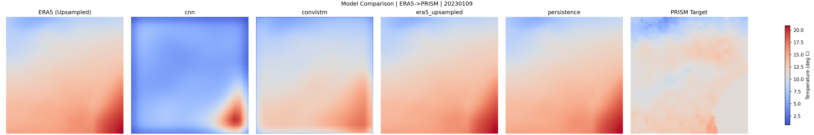
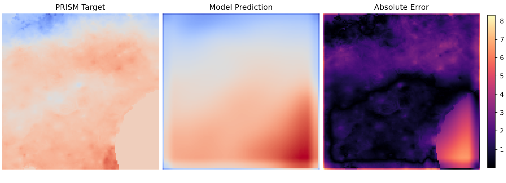
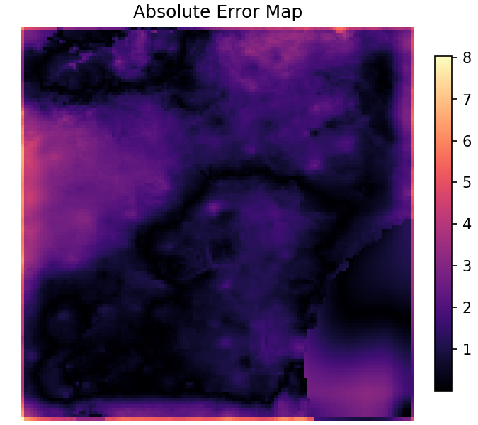

# Robust Earth Forecast

Regional ERA5 → PRISM temperature downscaling over Georgia using simple baselines and two temporal/spatial neural models (CNN, ConvLSTM).

## Problem

- **Input**: ERA5 daily fields on a coarse grid.
- **Target**: PRISM daily temperature rasters on a finer grid.
- **Goal**: learn a supervised mapping from coarse atmospheric context to a higher-resolution regional field.

## Models

- **persistence**: upsample the most recent ERA5 temperature frame
- **linear**: global linear mapping on the upsampled persistence baseline
- **cnn**: spatial mapping from stacked ERA5 history → PRISM field
- **convlstm**: temporal sequence model over ERA5 history → PRISM field

This repository intentionally stays within these model families (no transformers, no large architectures).

## Repository layout

- `data_pipeline/`: download + validate ERA5/PRISM data
- `datasets/`: dataset construction and alignment checks
- `models/`: baselines and neural models
- `training/`: training + experiment runners
- `evaluation/`: evaluation and plotting

Generated artifacts are written under `results/` and `checkpoints/` but are **ignored by git**.

## Setup

```bash
python3 -m venv .venv
source .venv/bin/activate
pip install -r requirements.txt
```

## Download data (example)

```bash
python3 data_pipeline/download_era5_georgia.py --year 2023 --month 1 --overwrite
python3 data_pipeline/download_prism.py --start-date 20230101 --days 30 --variable tmean
```

## Train a model

```bash
python3 training/train_downscaler.py \
  --model convlstm \
  --input-set t2m \
  --history-length 3 \
  --epochs 20 \
  --learning-rate 8e-4 \
  --weight-decay 1e-6 \
  --l1-weight 0.1 \
  --grad-clip 1.0 \
  --split-seed 42 \
  --seed 42
```

Training writes:
- a checkpoint to `checkpoints/`
- a training log (`.csv` + `.json`) to `results/`

## Evaluate

```bash
python3 evaluation/evaluate_model.py \
  --models persistence era5_upsampled linear cnn convlstm \
  --input-set t2m \
  --history-length 3 \
  --num-samples 8 \
  --split-seed 42
```

Evaluation writes per-model `metrics.json` and a `baselines_summary.csv`. It validates that the CSV and JSON are consistent; mismatches raise `ValueError("Metrics mismatch between JSON and CSV")`.

## Results

ConvLSTM (history=3, input=core4) achieves **RMSE 1.57**, improving over persistence (**2.36**) by **33.34%**.







Example metrics (from the controlled `t2m` vs `core4` grid; see `results/experiments/summary.csv`):

| model | RMSE | MAE |
| --- | ---: | ---: |
| persistence (history=3) | 2.356 | 1.809 |
| convlstm (t2m, history=3) | 2.004 | 1.391 |
| convlstm (core4, history=3) | 1.570 | 1.197 |

Observations (concise interpretation):
- Multi-variable `core4` improves RMSE vs `t2m` for ConvLSTM at the best setting (history=3).
- RMSE peaks at **history=3** for ConvLSTM in both input sets; history=6 does not further reduce RMSE.
- CNN does not beat persistence in this grid.
- Errors concentrate in high-gradient regions (see the error map).

Important note: some configurations underperform persistence (e.g., CNN in this grid, and ConvLSTM with history=1). These runs are included for honest comparison.

### Error Analysis

For **ConvLSTM + core4 + history=3**, we compared mean absolute error to a simple **PRISM spatial-gradient** proxy (finite differences on the target field; see `scripts/spatial_error_analysis.py` and `docs/experiments/error_analysis.json`).

- The model is **relatively accurate in smooth regions** (low mean absolute error where gradients are small).
- Mean absolute error shows only a **modest positive association** with mean gradient magnitude (**Pearson r ≈ 0.08** on per-pixel maps averaged over validation samples; pooled r ≈ 0.04). High-gradient areas contribute **somewhat**, but **do not dominate** total error.
- This supports a limitation in **fine-scale spatial variability** (sharp transitions are harder), while **other factors** (temporal context, bias, misalignment) still matter.

## Notebook

Open `notebooks/analysis.ipynb` to reproduce:
- ERA5 vs PRISM visualization
- model predictions vs ground truth
- baseline vs model comparison
- metrics table and brief observations

## Experiments

### Temporal history-length sweep

Runs short train+eval loops for a list of history lengths and writes `results/temporal_analysis/temporal_summary.csv`.

```bash
python3 training/run_temporal_analysis.py --histories 1 3 6 --models cnn convlstm --epochs 5
```

### ERA5-variable ablation (optional)

This only applies if your ERA5 NetCDF contains multiple variables. The default example dataset in this repo ships with `t2m` only.

```bash
python3 training/run_ablation.py --model convlstm --era5-variables t2m --epochs 5
```

## Limitations

- Regional scope (Georgia) and limited time coverage by default
- Models are trained from scratch and are meant as baselines/controlled studies
- Results depend on the available ERA5 variables and the PRISM date coverage you download

## Future work

- Extend temporal coverage (more months/years)
- Expand ERA5 variable sets where available
- Improve calibration/uncertainty reporting after baseline performance is stable
