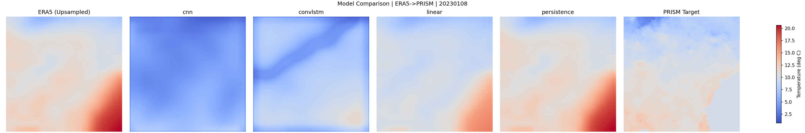

# Robust Earth Forecast

ERA5 to PRISM downscaling over Georgia with multi-variable inputs, classical baselines, and temporal deep learning.

## Problem

ERA5 has coarse spatial resolution. PRISM provides finer regional temperature fields. The target mapping is:

`ERA5(t-k+1 ... t) -> PRISM(t)`

## Approach

Models in this pipeline:

- persistence baseline
- global linear baseline
- CNN baseline
- ConvLSTM temporal model

ERA5 input channels are:

- `2m_temperature`
- `10m_u_component_of_wind`
- `10m_v_component_of_wind`
- `surface_pressure`

Using only temperature was limiting. Adding wind and pressure improved the model behavior.

## Data Requirements

- `data_raw/era5_georgia_temp.nc`
- `data_raw/prism/` with dated rasters (`.bil`, `.tif`, `.tiff`, `.asc`)

Temporal models need enough consecutive dates. For `history-length=3`, use at least 20-30 PRISM days for a stable run.

## Run

```bash
git clone https://github.com/venkatavivekp-debug/robust-earth-forecast.git
cd robust-earth-forecast
python3 -m venv .venv
source .venv/bin/activate
pip install -r requirements.txt

python data_pipeline/download_era5_georgia.py --year 2023 --month 1
python data_pipeline/download_prism.py --start-date 20230101 --days 30 --variable tmean

python training/train_downscaler.py --model cnn --history-length 3 --epochs 25 --learning-rate 1e-3 --split-seed 42
python training/train_downscaler.py --model convlstm --history-length 3 --epochs 40 --learning-rate 3e-4 --split-seed 42

python evaluation/evaluate_model.py --models persistence linear cnn convlstm --history-length 3 --num-samples 8 --split-seed 42

jupyter notebook notebooks/era5_prism_downscaling.ipynb
```

## Results



Latest metrics (`results/evaluation/baselines_summary.csv`):

- persistence: RMSE 3.251, MAE 2.611
- linear: RMSE 2.965, MAE 2.605
- cnn: RMSE 3.974, MAE 3.446
- convlstm: RMSE 3.098, MAE 2.513

ConvLSTM training is now much more stable than before and clearly better than the CNN run in this setup, while linear remains strongest on this data slice.

## Current Observation

Simple baselines remain strong under limited data.
Temporal models need enough dates and careful optimization.
The multi-variable setup is a stronger base than the earlier temperature-only version.

## Limitations

- one region (Georgia)
- short temporal coverage compared with operational systems
- one target variable (temperature)
- deep models remain data-sensitive

## Relation to Existing Work

ConvLSTM is a standard temporal model for sequence-conditioned spatial prediction. This repository focuses on a smaller regional downscaling problem and does not attempt to reproduce large global weather systems.

## Direction

- longer temporal windows
- more ERA5 variables
- multi-source geospatial inputs
- uncertainty-aware forecasting
