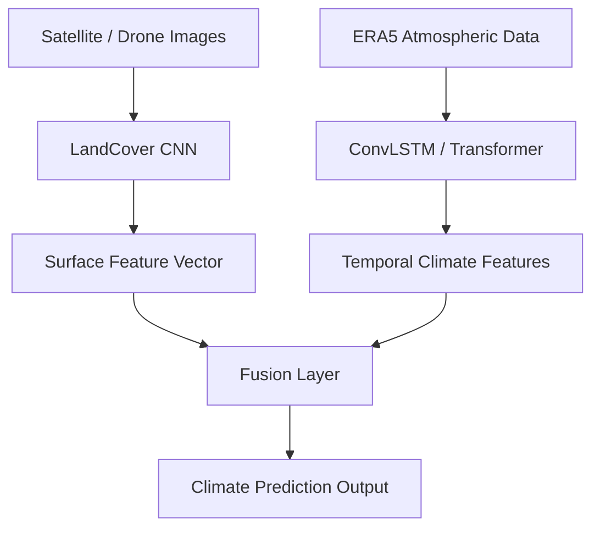

# Robust Earth Forecast

Robust Earth Forecast is an experimental deep learning project focused on modeling environmental and atmospheric data using modern spatiotemporal machine learning approaches.

The goal of the project is to explore how different neural network architectures can learn spatial and temporal patterns from climate datasets and remote sensing imagery. Environmental systems such as the atmosphere and land surface are highly dynamic, and understanding their interactions requires models that can process both spatial structure and temporal evolution.

This repository experiments with multiple modeling approaches applied to climate reanalysis data and satellite imagery. ERA5 atmospheric pressure-level data is used to study short-term forecasting of atmospheric variables, while satellite land-cover imagery is used to capture surface information that may influence environmental patterns.

Several model architectures are explored throughout the project:

• **ConvLSTM models** for learning spatiotemporal patterns in atmospheric pressure-level data  
• **3D CNN models** for volumetric climate forecasting tasks  
• **Transformer-based models** to investigate attention mechanisms for temporal prediction  
• **CNN models for remote sensing** to extract land-cover features from satellite imagery  
• **Multimodal fusion models** that combine atmospheric data and satellite imagery to explore how surface characteristics might improve climate predictions

The broader objective is to experiment with integrating multiple environmental data sources into a unified learning framework. Real-world Earth system modeling often relies on combining atmospheric data, satellite observations, and temporal patterns, and this project explores how deep learning models can be structured to support that type of integration.

This project is primarily intended as a learning and research exploration of spatiotemporal deep learning for environmental systems, with a focus on climate modeling, geospatial data analysis, and multimodal machine learning approaches.

## Model Architecture



## Project Structure

```
robust-earth-forecast
│
├── src
│   ├── models
│   │   ├── convlstm.py
│   │   ├── cnn3d_forecaster.py
│   │   ├── transformer_forecaster.py
│   │   └── multimodal_forecaster.py
│   │
│   └── remote_sensing
│       └── cnn_landcover.py
│
├── scripts
│   ├── train_pressure_levels.py
│   ├── eval_pressure_levels.py
│   └── train_multimodal.py
│
├── README.md
├── requirements.txt
└── .gitignore
```

## Future Work

This project is an ongoing exploration of deep learning approaches for environmental modeling. Possible next steps include:

• Incorporating higher-resolution satellite or drone imagery  
• Experimenting with additional multimodal fusion strategies  
• Evaluating transformer-based spatiotemporal models on climate data  
• Investigating uncertainty-aware prediction for environmental forecasting

Author:
Venkata Vivek Panguluri
M.S. Computer Science
University of Georgia
