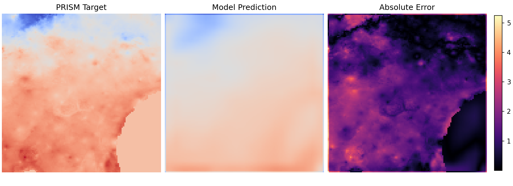
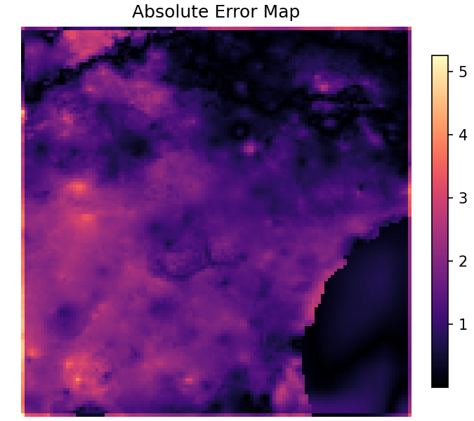

# Robust Earth Forecast

A regional spatiotemporal deep learning pipeline for ERA5 to PRISM climate downscaling over Georgia.

## Problem

ERA5 provides coarse reanalysis fields, while PRISM provides higher-resolution temperature targets. The task is supervised downscaling: learn a mapping from coarse ERA5 grids to finer PRISM temperature fields for Georgia.

## Why These Inputs

The core variables are surface temperature (`t2m`), near-surface wind (`u10`, `v10`), and surface pressure (`sp`). These provide direct local thermodynamic and circulation context.

The extended input set adds precipitation, 2m relative humidity, and pressure-level information (`t`, `rh`, geopotential height at 850/500 hPa). This adds vertical and moisture structure that helps constrain near-surface temperature patterns. In current experiments, richer atmospheric context improves prediction quality.

## Model Choice

- `persistence`: reference baseline using upsampled latest ERA5 temperature
- `linear`: global linear mapping baseline
- `cnn`: spatial coarse-to-fine mapping baseline
- `convlstm`: spatial + temporal sequence model over ERA5 history

## What Experiments Were Done

- Training stability and tuning updates: scheduler, gradient clipping, light weight decay, train-split normalization reuse
- Loss refinement for less smoothing: `MSE + 0.1 * L1`
- Temporal analysis: history lengths `1`, `3`, `6` for CNN and ConvLSTM
- Input ablation: `t2m` vs `core4` vs `extended`

Traceability:

- learning-rate sweep: `1e-3`, `5e-4`, `1e-4` (`results/tuning/tuning_summary.csv`)
- longer convergence runs for final checkpoints (CNN 55 epochs, ConvLSTM 60 epochs)
- history-length comparison and ablation summaries saved under `results/temporal_analysis/` and `results/ablation/`

## Main Findings

- Extended variables outperform reduced input sets in ablation (`results/ablation/ablation_summary.csv`).
- Temporal context improves ConvLSTM relative to history `1` (`results/temporal_analysis/temporal_summary.csv`).
- Longer runs with scheduler control improve both CNN and ConvLSTM convergence behavior.
- On the fair split used in evaluation, tuned ConvLSTM is best.

From `results/evaluation/baselines_summary.csv` (history `3`, input set `extended`):

- persistence: RMSE `3.251`, MAE `2.611`, CORR `0.640`
- linear: RMSE `2.965`, MAE `2.605`, CORR `0.640`
- cnn: RMSE `2.869`, MAE `2.474`, CORR `0.743`
- convlstm: RMSE `1.765`, MAE `1.448`, CORR `0.807`

## Why This Setup Is Reasonable

Downscaling is a coarse-to-fine learning problem. Surface temperature depends on more than temperature alone, so multi-variable conditioning is necessary. Atmospheric state evolves over time, so temporal context is important for sequence-to-field prediction. Using train-split normalization and a fixed evaluation split is required for credible model comparison.

## Relation to Existing Work

This setup is closest to CNN-based climate downscaling work such as DeepSD-style coarse-to-fine supervised mapping: low-resolution atmospheric input to high-resolution regional target.

It is also informed by multi-variable and temporal reasoning used in modern weather/climate models (including Prithvi WxC-style directions). This repository does not reproduce large pretrained systems; it studies the same class of problem in a smaller regional supervised setting.

## Limitations

- Regional scope limited to Georgia
- Small temporal/data coverage compared with large weather archives
- Models are trained from scratch, not pretrained

## Future Direction

- Add more predictor variables and larger temporal coverage
- Train on more months/years and broader regional subsets
- Extend sequence length and training duration
- Add uncertainty-aware heads after baseline performance is stable

## Results Callouts






Supporting summaries:

- `results/evaluation/baselines_summary.csv`
- `results/temporal_analysis/temporal_summary.csv`
- `results/ablation/ablation_summary.csv`

## Run

```bash
git clone https://github.com/venkatavivekp-debug/robust-earth-forecast.git
cd robust-earth-forecast
python3 -m venv .venv
source .venv/bin/activate
pip install -r requirements.txt

python data_pipeline/download_era5_georgia.py --year 2023 --month 1 --overwrite
python data_pipeline/download_prism.py --start-date 20230101 --days 30 --variable tmean

python training/tune_downscaler.py --models cnn convlstm --input-set extended --history-lengths 3 6 --learning-rates 1e-3 5e-4 1e-4 --weight-decays 0 1e-5 --epochs 20 --split-seed 42

python training/train_downscaler.py --model cnn --input-set extended --history-length 3 --epochs 55 --learning-rate 5e-4 --weight-decay 0 --l1-weight 0.1 --split-seed 42 --grad-clip 1.0 --run-name cnn
python training/train_downscaler.py --model convlstm --input-set extended --history-length 3 --epochs 60 --learning-rate 8e-4 --weight-decay 1e-6 --l1-weight 0.1 --split-seed 42 --grad-clip 1.0 --run-name convlstm

python training/run_temporal_analysis.py --input-set extended --histories 1 3 6 --cnn-lr 5e-4 --convlstm-lr 8e-4 --cnn-epochs 20 --convlstm-epochs 30 --cnn-wd 0 --convlstm-wd 1e-6 --l1-weight 0.1 --split-seed 42
python training/run_ablation.py --model convlstm --input-sets t2m core4 extended --history-length 6 --epochs 30 --learning-rate 8e-4 --weight-decay 1e-6 --l1-weight 0.1 --split-seed 42

python evaluation/evaluate_model.py --input-set extended --models persistence linear cnn convlstm --history-length 3 --num-samples 8 --split-seed 42

jupyter notebook notebooks/era5_prism_downscaling.ipynb
```
