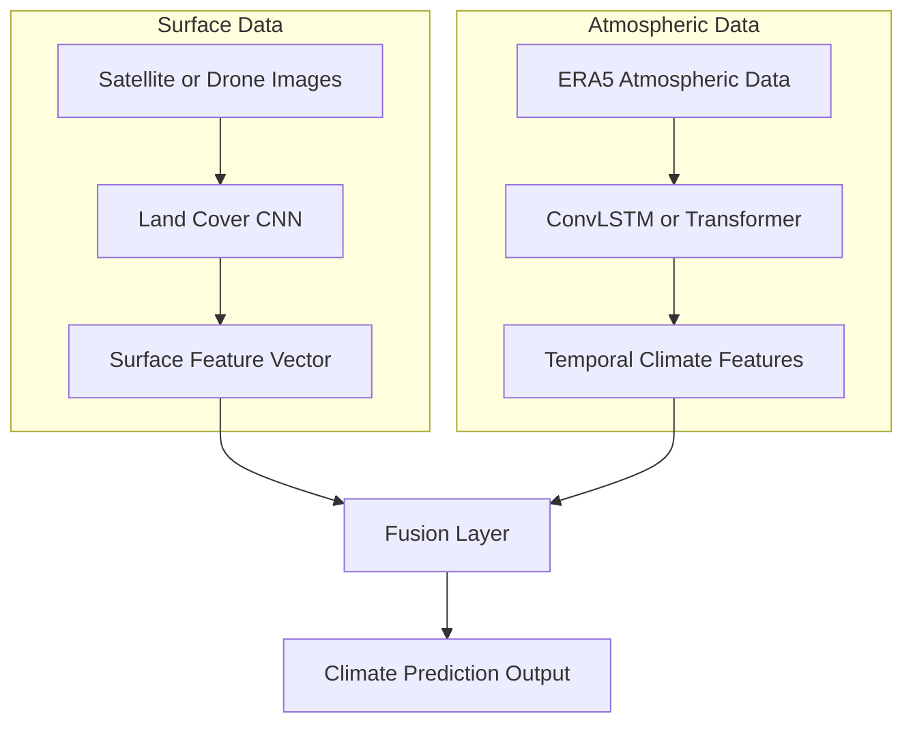

# Robust Earth Forecast

Robust Earth Forecast is a research-oriented deep learning project for climate downscaling and environmental prediction.

The goal is to learn how coarse-resolution atmospheric data (ERA5) can be transformed into high-resolution regional predictions (PRISM) using deep learning.

---

## Research Motivation

Climate datasets are often low-resolution, which limits regional analysis.

This project explores learning a mapping:

ERA5 (low resolution) → Deep Learning Model → High-resolution prediction

---

## Current Goals

- Build a clean ERA5 data pipeline  
- Prepare datasets for downscaling  
- Train deep learning models  
- Evaluate predictions  
- Visualize climate outputs  

---

## Datasets

### ERA5
- Global atmospheric reanalysis dataset  
- Used as input (low resolution)

### PRISM
- High-resolution climate dataset  
- Used as ground truth

### Region
- Georgia (initial experiments)

---

## Models

### CNN Downscaler
- Learns spatial mapping (ERA5 → PRISM)

### ConvLSTM
- Captures temporal climate patterns

### Transformer (planned)
- For advanced climate modeling

---

## Model Architecture

## Conclusion

This project demonstrates how deep learning can be used to enhance the spatial resolution of climate data.

The CNN-based downscaling approach successfully learns spatial patterns from ERA5 inputs and produces outputs that resemble high-resolution PRISM data.

This serves as a strong baseline for further research in climate AI and spatiotemporal modeling.

## Future Work

- Improve model accuracy with deeper architectures (UNet, ResNet)
- Incorporate temporal models (ConvLSTM, Transformers)
- Extend to multi-variable climate prediction
- Add larger datasets and longer time ranges
- Explore foundation models for climate (e.g., transformer-based approaches)

## Author

Venkata Vivek Panguluri  
M.S. Computer Science  
University of Georgia
