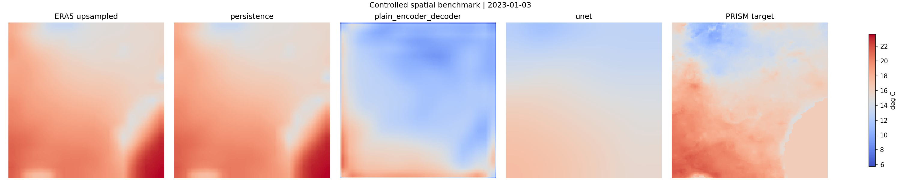
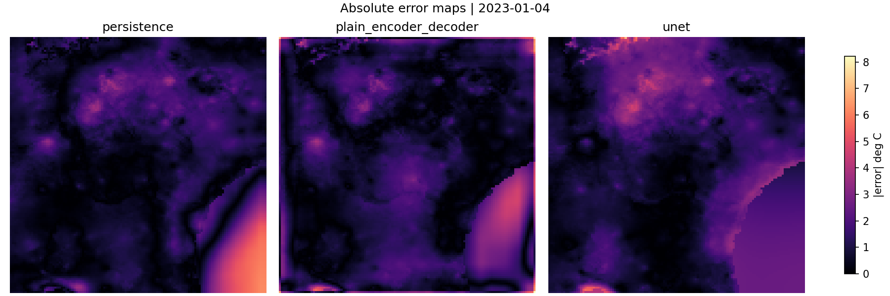

# Robust Earth Forecast

ERA5 -> PRISM daily temperature downscaling over Georgia. The research question is whether a learned model can recover PRISM-scale spatial structure beyond upsampled ERA5 while staying comparable to persistence and interpolation baselines.

This repository is organized around the downscaling problem rather than model chasing: aligned data, controlled baselines, reproducible training/evaluation, and diagnostics for spatial reconstruction quality.

## Current Research Status

- The current reference learned model is a no-skip encoder-decoder baseline: `PlainEncoderDecoder` / `EncoderDecoderBaseline` (`cnn` alias kept for archived checkpoints and scripts).
- The active focus is diagnosing spatial reconstruction limits: blur, border artifacts, residual structure, and split sensitivity.
- A controlled spatial benchmark now compares persistence, `PlainEncoderDecoder`, and a skip-connected U-Net under identical data, split, normalization, target mode, and diagnostics.
- ConvLSTM results are retained as archived temporal evidence, but temporal modeling is intentionally secondary until the spatial baseline is understood.

## Result Snapshot

| Dataset | Best archived config | Best RMSE | Persistence RMSE | Delta vs persistence |
| --- | --- | ---: | ---: | ---: |
| small | ConvLSTM `core4_h3` | 1.5704300999641418 | 2.355815142393112 | -0.7853850424289703 |
| medium | ConvLSTM `core4_h3` | 1.581842489540577 | 2.966560184955597 | -1.38471769541502 |

The medium run uses more days, but the best single-split RMSE is basically flat. Its main benefit is stability: weak configurations fail less often, and multi-seed results make the split sensitivity visible.


Figures above are committed outputs from the `core4_h3` evaluation run. Full tables are in [`docs/experiments/results_summary.md`](docs/experiments/results_summary.md), [`docs/experiments/data_scaling.md`](docs/experiments/data_scaling.md), and the JSON summaries under `docs/experiments/`.

## Main Observations

- Persistence is strong: latest ERA5 `t2m`, upsampled, already carries much of the daily temperature field.
- ConvLSTM is strongest in the archived encoder-decoder/ConvLSTM grid, but the exact winner depends on split, input set, and history length.
- More data improved stability more than peak RMSE.
- Spatial error has structure; PRISM gradient alone explains little of it (`r ~= 0.08` on mean maps, `~0.04` pooled).
- Border diagnostics confirmed that the plain encoder-decoder baseline is weak near regional edges.

All results are reported with variability across splits rather than as a single clean run.

## Controlled Spatial Benchmark

Medium `core4_h3`, direct target mode, seed 42, all 18 validation samples:

| Model | RMSE | MAE | Border RMSE | Center RMSE |
| --- | ---: | ---: | ---: | ---: |
| persistence | 2.8467 | 1.9428 | 3.5826 | 2.5596 |
| PlainEncoderDecoder | 2.2313 | 1.7827 | 2.5038 | 2.1344 |
| U-Net | 1.8939 | 1.4901 | 2.1607 | 1.7978 |





The skip-connected U-Net improves over the no-skip baseline on this split, but border error is still higher than center error. This supports U-Net as the next spatial baseline; it does not close the downscaling problem.

Details: [`docs/experiments/spatial_benchmark.md`](docs/experiments/spatial_benchmark.md). Earlier residual and ConvLSTM diagnostics are kept in [`docs/experiments/underperformance_diagnosis.md`](docs/experiments/underperformance_diagnosis.md).

## Seed stability (spatial benchmark)

Three additional splits (seeds **42, 7, 123**) on **medium `core4` h3 direct** show **U-Net with the lowest mean RMSE** versus persistence and PlainEncoderDecoder, but **seed 123** is **mixed**: PlainEncoderDecoder RMSE is slightly **lower** than U-Net there. **Border RMSE stays above center RMSE** for every model and seed. See [`docs/experiments/spatial_benchmark_seed_stability.md`](docs/experiments/spatial_benchmark_seed_stability.md) and local `results/spatial_benchmark_seed_stability/summary.csv`.

## Boundary Artifact Diagnosis

Padding/upsampling settings were audited after Professor Hu's boundary-artifact feedback. The current models use bilinear interpolation and no deconvolution; `PlainEncoderDecoder` uses zero-padded `3x3` convs, while U-Net uses reflection-padded conv blocks.

Across the three spatial benchmark seeds, border RMSE remains higher than center RMSE for persistence, `PlainEncoderDecoder`, and U-Net. U-Net lowers absolute border error on average, but it does not remove border degradation. This motivated the controlled padding/upsampling ablation below, before adding topography or temporal modeling. Details: [`docs/experiments/boundary_artifact_diagnosis.md`](docs/experiments/boundary_artifact_diagnosis.md).

## Controlled Boundary Ablation

The U-Net boundary ablation isolates padding and decoder upsampling on the same medium `core4_h3` split. Replicate padding gives the lowest RMSE in this single run (`1.7995`), while ConvTranspose2d lowers the border/center ratio but does not beat the best full-image RMSE. Border error remains higher than center error for every variant, so boundary behavior is still active research rather than solved. Details: [`docs/experiments/boundary_ablation_results.md`](docs/experiments/boundary_ablation_results.md).

## Repository Structure

- `data_pipeline/`: ERA5 and PRISM download/validation entry points.
- `datasets/`: ERA5/PRISM alignment and dataset path resolution.
- `models/`: baseline architecture implementations.
- `training/`: trainer CLI and checkpoint writing.
- `evaluation/`: metrics, plots, and baseline evaluation.
- `scripts/`: experiment orchestration, result validation, and spatial diagnostics.
- `docs/experiments/`: committed metrics, comparisons, and diagnosis notes.
- `docs/research/`: problem framing, comparison protocol, and failure-mode notes.

## Data and Models

- **Predictors:** ERA5 over Georgia, mainly `t2m` and `core4` (`t2m`, `u10`, `v10`, `sp`).
- **Target:** PRISM daily mean temperature (`tmean`).
- **Histories:** 1, 3, and 6 days.
- **Models:** `PlainEncoderDecoder` stacks history as channels; U-Net is the skip-connected spatial baseline under controlled comparison; ConvLSTM keeps the time axis explicit for archived temporal runs.
- **Baselines:** persistence, upsampled ERA5, and a linear baseline.

Default small data is January 2023. Medium data is 2023-01-01 through 2023-03-31.

## Diagnostics Philosophy

RMSE is necessary but not enough. Spatial downscaling also needs:

- prediction-vs-target panels;
- absolute error maps;
- border-vs-center error;
- prediction variance and oversmoothing checks;
- gradient/error analysis;
- stability across seeds and splits.

Changing architecture, target mode, split, and inputs at the same time makes conclusions hard to interpret. Future comparisons should isolate one change at a time.

## Reproduce

```bash
python3 -m venv .venv
source .venv/bin/activate
pip install -r requirements.txt

python3 data_pipeline/download_era5_georgia.py --year 2023 --month 1 --overwrite
python3 data_pipeline/download_prism.py --start-date 20230101 --days 30 --variable tmean

python3 scripts/run_core_experiments.py \
  --input-sets t2m core4 \
  --histories 1 3 6 \
  --split-seed 42 \
  --seed 42 \
  --overwrite

python3 scripts/validate_results.py --dataset-version small
python3 scripts/summarize_results.py --dataset-version small
```

Medium validation:

```bash
python3 scripts/validate_results.py --dataset-version medium
python3 scripts/summarize_results.py --dataset-version medium
```

Use `scripts/run_core_experiments.py` for archived encoder-decoder/ConvLSTM sweeps. `training/run_temporal_analysis.py` and `training/run_ablation.py` are older runners and do not match the current trainer CLI.

## Limitations

- Short regional sample, especially in the default small run.
- Georgia-only bbox; no transfer claim.
- ERA5 and PRISM differ in grid, physics, and observation influence.
- No static terrain field is used yet.
- RMSE rankings are split-sensitive, so the stability tables matter.
- U-Net stability has been checked on three seeds, but boundary behavior remains unresolved.

## Notes

- Notebook companion: [`notebooks/analysis.ipynb`](notebooks/analysis.ipynb)
- Repository philosophy: [`docs/research/repository_philosophy.md`](docs/research/repository_philosophy.md)
- Baseline definition: [`docs/research/current_baseline_definition.md`](docs/research/current_baseline_definition.md)
- Spatial benchmark protocol: [`docs/research/spatial_benchmark_protocol.md`](docs/research/spatial_benchmark_protocol.md)
- Padding/boundary audit: [`docs/research/padding_boundary_audit.md`](docs/research/padding_boundary_audit.md)
- Boundary ablation protocol: [`docs/research/boundary_ablation_protocol.md`](docs/research/boundary_ablation_protocol.md)
- Controlled comparison protocol: [`docs/research/controlled_comparison_protocol.md`](docs/research/controlled_comparison_protocol.md)
- Failure mode catalog: [`docs/research/failure_mode_catalog.md`](docs/research/failure_mode_catalog.md)
- Refactor plan: [`docs/research/final_repo_refactor_plan.md`](docs/research/final_repo_refactor_plan.md)
