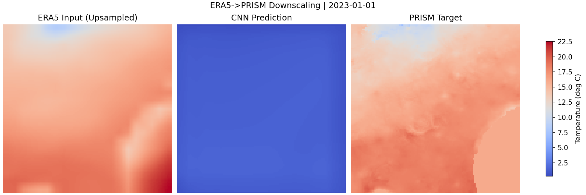

# Robust Earth Forecast

A clean, research-quality baseline for **temporal climate downscaling** over Georgia.

## 1) Project Overview

This project predicts high-resolution PRISM temperature from coarse ERA5 reanalysis using temporal context:

- input: ERA5 sequence `[t-k+1 ... t]`
- target: PRISM map at time `t`
- baseline model: compact CNN that treats time as input channels

Why it matters: climate models and reanalysis are often coarse, while decision-making needs finer local structure.

## 2) What Is ERA5 vs PRISM

- **ERA5**: global reanalysis, coarse spatial grid, strong temporal coverage.
- **PRISM**: higher-resolution gridded climate observations for regional analysis.

This baseline learns a supervised mapping from coarse ERA5 to finer PRISM.

## 3) Temporal Modeling Upgrade

Previous baseline:

```text
ERA5(t) -> PRISM(t)
```

Current baseline:

```text
ERA5(t-k+1 ... t) -> PRISM(t)
```

The `--history-length` argument controls `k` (default `3`).

## 4) Pipeline Summary

```text
Download ERA5 + PRISM
        ->
Date matching + temporal window construction
        ->
Temporal CNN training
        ->
Inference at PRISM resolution
        ->
Evaluation (RMSE, MAE, comparison plot)
```

## 5) Exact Run Commands

Run from project root:

```bash
python -m venv .venv
source .venv/bin/activate
pip install -r requirements.txt
python data_pipeline/download_era5_georgia.py
python data_pipeline/download_prism.py
python training/train_downscaler.py \
  --history-length 3 \
  --epochs 20 \
  --batch-size 4 \
  --learning-rate 1e-3 \
  --checkpoint-out checkpoints/cnn_downscaler_best.pt
python evaluation/evaluate_model.py \
  --history-length 3 \
  --checkpoint-path checkpoints/cnn_downscaler_best.pt \
  --num-samples 8 \
  --num-plots 1 \
  --results-dir results/evaluation
jupyter notebook notebooks/climate_forecasting_demo.ipynb
```

Defaults used by train/eval if not provided:

- ERA5 path: `data_raw/era5_georgia_temp.nc`
- PRISM path: `data_raw/prism`
- checkpoint: `checkpoints/cnn_downscaler_best.pt`

## 6) Example Output

Saved evaluation artifact:



Interpretation:

- left: most recent ERA5 frame (`t`) upsampled to PRISM grid
- middle: temporal CNN prediction
- right: PRISM ground truth

Metrics are written to:

- `results/evaluation/metrics.json`

with fields:

- `rmse`
- `mae`
- `num_samples`
- `history_length`

## 7) Next Steps

This repository is a minimal, strong baseline. Logical research upgrades:

1. Temporal encoder upgrade (ConvLSTM / temporal transformers).
2. Multimodal predictors (humidity, pressure, wind, topography).
3. Uncertainty-aware outputs (ensembles or probabilistic losses).

## Common Errors

- Missing ERA5 file:
  - `ERA5 file not found: data_raw/era5_georgia_temp.nc`
  - Run: `python data_pipeline/download_era5_georgia.py`

- Missing PRISM rasters:
  - `No PRISM raster files found in data_raw/prism`
  - Run: `python data_pipeline/download_prism.py`

- Missing checkpoint:
  - `Checkpoint not found: checkpoints/cnn_downscaler_best.pt`
  - Run training first, then evaluation.

## Repository Structure

```text
robust-earth-forecast/
├── data_pipeline/
├── datasets/
├── models/
├── training/
├── evaluation/
├── notebooks/
├── results/
│   └── evaluation/
│       ├── comparison.png
│       └── metrics.json
├── README.md
├── requirements.txt
└── .gitignore
```
