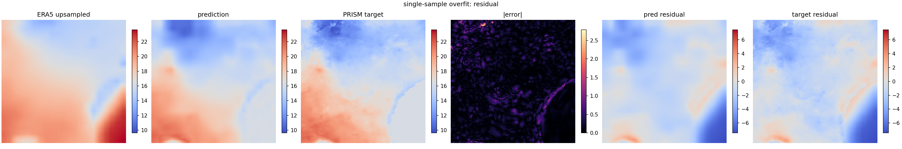

# Training Sanity Checks

The model still looks visually smooth after U-Net, terrain channels, residual learning, boundary ablations, and gradient-aware losses. This check asks a simpler question: can the current training path memorize tiny data?

## Setup

- Dataset: medium
- Model: U-Net
- Inputs: `core4_topo`
- Padding/upsampling: replicate + bilinear
- Target modes: direct and residual for one-sample check; residual for subset/capacity checks
- Static terrain file: `data_processed/static/georgia_prism_topography.nc`

## One-Sample Overfit

| Target mode | Epochs | RMSE | MAE | Gradient ratio | High-frequency ratio |
| --- | ---: | ---: | ---: | ---: | ---: |
| direct | 600 | 0.4563 | 0.3214 | 0.4689 | 0.0098 |
| residual | 600 | 0.2249 | 0.1546 | 0.6650 | 0.2325 |

Residual prediction is easier, but the model does not reach near-zero error on one sample.

## Small-Subset Overfit

| Train samples | Epochs | Train RMSE | Validation RMSE | Train gradient ratio | Train high-frequency ratio |
| ---: | ---: | ---: | ---: | ---: | ---: |
| 4 | 500 | 0.2958 | 2.4328 | 0.5850 | 0.0936 |
| 8 | 500 | 0.4906 | 2.1597 | 0.5550 | 0.0674 |

The model learns the small training subsets but does not memorize them strongly. Validation remains much worse, which is expected with tiny subsets, but the train error is the more important warning sign.

## LR / Width Check

| Base channels | LR | Epochs | Train RMSE | Validation RMSE | Train high-frequency ratio |
| ---: | ---: | ---: | ---: | ---: | ---: |
| 24 | 1e-3 | 300 | 0.5289 | 2.0561 | 0.0527 |
| 24 | 3e-4 | 300 | 0.5102 | 2.2982 | 0.0363 |
| 24 | 1e-4 | 300 | 0.6659 | 2.3938 | 0.0324 |
| 48 | 1e-3 | 300 | 0.3660 | 2.0311 | 0.0778 |
| 48 | 3e-4 | 300 | 0.4444 | 2.2916 | 0.0411 |
| 48 | 1e-4 | 300 | 0.5312 | 2.3315 | 0.0339 |

Doubling width helps, especially at `1e-3`, but it still does not produce a clean memorization pass.

## Conclusion

This supports Professor Hu's concern that the outputs are not just visually rough. The current setup has a real training/reconstruction limitation. No obvious date/unit/residual-scaling bug was found, but the U-Net should fit tiny samples more aggressively than it does here.

Next debug step: inspect target formulation, decoder/output-size behavior, and local residual amplitude suppression before adding temporal models or new input features.
