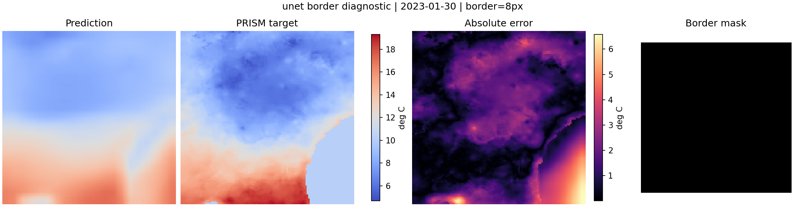

# Underperformance diagnosis

Initial check covered `models/`, `training/`, `evaluation/`, `datasets/prism_dataset.py`, `notebooks/analysis.ipynb`, README figures, and committed experiment JSONs. This note keeps the earlier U-Net/residual follow-up and points to the newer fixed-protocol spatial benchmark.

## Architecture notes

- Plain encoder-decoder baseline: `CNNDownscaler` applies same-size `Conv2d(..., padding=1)` blocks on the ERA5 grid, bilinearly upsamples feature maps to PRISM size, then applies a padded `3x3` conv and final `1x1` conv. The historical CLI/checkpoint alias is `cnn`.
- ConvLSTM decoder: `ConvLSTMCell` uses `padding=kernel_size//2`; the hidden state is bilinearly upsampled, passed through a padded readout conv, and added to an upsampled latest-`t2m` base when `out_channels == 1`.
- `ConvTranspose2d` is not used.
- Output size is forced by `target_size=(y.shape[-2], y.shape[-1])`; evaluation raises on prediction/target shape mismatch.
- PRISM rasters are clipped to ERA5 bounds and later rasters are `rio.reproject_match`ed to the first PRISM template. This gives consistent tensor shape, but edge pixels still deserve attention because the target itself is a clipped regional window.

## Border diagnostic

Command:

```bash
.venv/bin/python scripts/check_spatial_artifacts.py --device cpu
.venv/bin/python scripts/check_spatial_artifacts.py --device cpu --model cnn \
  --output-json results/diagnostics/spatial_artifacts_core4_h3_cnn.json \
  --output-panel results/diagnostics/spatial_artifacts_core4_h3_cnn.png
```

Border width: 8 PRISM pixels. Validation split comes from the stored `core4_h3` checkpoints.

| Model | RMSE | MAE | Border RMSE | Center RMSE | Border/Center | Border pred mean | Center pred mean | Target border mean | Target center mean |
| --- | ---: | ---: | ---: | ---: | ---: | ---: | ---: | ---: | ---: |
| ConvLSTM `core4_h3` | 1.571948 | 1.196809 | 2.347021 | 1.214406 | 1.932649 | 10.274251 | 11.965181 | 11.162066 | 11.637097 |
| PlainEncoderDecoder `core4_h3` (`cnn`) | 3.497680 | 2.731013 | 4.325209 | 3.179704 | 1.360255 | 9.357196 | 12.690310 | 11.162066 | 11.637097 |

Border artifacts are confirmed for the current checkpoints. Both learned models predict lower border means than the PRISM border mean; ConvLSTM has the larger border/center RMSE ratio, while the plain encoder-decoder baseline is worse overall.

## Earlier spatial baseline check

Medium `core4_h3`, split seed 42, training seed 42. Border metrics use the full stored validation split (18 samples). The U-Net runs use bilinear upsampling plus `Conv2d` blocks with reflection padding; no `ConvTranspose2d` was added. This table is the earlier residual-target diagnosis, not the current fixed-protocol direct benchmark.

| Model | Target mode | RMSE | MAE | Border RMSE | Center RMSE | Border/Center |
| --- | --- | ---: | ---: | ---: | ---: | ---: |
| PlainEncoderDecoder `core4_h3` (`cnn`) | direct | 2.1599 | 1.7344 | 2.3553 | 2.0918 | 1.1260 |
| U-Net `core4_h3` | direct | 1.7704 | 1.3709 | 2.0384 | 1.6731 | 1.2183 |
| U-Net `core4_h3` | residual | 1.5001 | 1.1417 | 1.8015 | 1.3871 | 1.2988 |
| ConvLSTM `core4_h3` | direct | 1.6705 | 1.2657 | 2.1265 | 1.4909 | 1.4263 |

Panel from the best spatial run: 

U-Net direct is a clear improvement over the plain encoder-decoder baseline. Residual prediction improves again and gives the best RMSE in this controlled check, including lower border RMSE than ConvLSTM. It does not remove the artifact: border error is still about 30% above center error.

ConvLSTM residual mode was skipped because the current ConvLSTM already adds an upsampled latest-`t2m` base internally. Adding the generic residual target mode there would make the residual definition ambiguous.

## Current fixed-protocol direct benchmark

The cleaner direct-target benchmark is now recorded in [`spatial_benchmark.md`](spatial_benchmark.md). It uses the same dataset, split, seed, target mode, optimizer settings, and all 18 validation samples for persistence, `PlainEncoderDecoder`, and U-Net.

| Model | RMSE | MAE | Border RMSE | Center RMSE | Border/Center |
| --- | ---: | ---: | ---: | ---: | ---: |
| persistence | 2.8466506862243577 | 1.942786613336184 | 3.5825521603086234 | 2.559619644749001 | 1.3996423912662743 |
| PlainEncoderDecoder | 2.2313389357026714 | 1.7826750643192193 | 2.5037854530924526 | 2.134421349139709 | 1.1730511663508323 |
| U-Net | 1.8938983473045878 | 1.4901164816111936 | 2.1606650140879413 | 1.7978037822151207 | 1.2018358374047526 |

U-Net still improves over the no-skip baseline in direct mode, but border error remains higher than center error. This is a spatial baseline improvement, not a final claim about the downscaling problem.

## Likely source

This does not look like a deconvolution artifact because there is no transposed convolution. The more likely source is weak spatial decoding plus edge behavior in padded convolutions. The plain encoder-decoder baseline is especially exposed because it predicts the full PRISM field without a residual path or skip connections. ConvLSTM helped in the archived grid partly because it already has a residual-style base, not only because of temporal memory.

Undertraining may contribute, but the new U-Net residual result shows the base spatial decoder was a real bottleneck. Missing context and limited data remain real, but adding temporal complexity before fixing the spatial baseline would have been hard to interpret.

## Next experiment plan

1. Re-run the fixed-protocol U-Net benchmark across the same multi-seed splits used in the stability analysis.
2. Compare direct vs residual U-Net as a separate target-mode ablation, not as an architecture-only claim.
3. Test topography/static fields only after adding real DEM data; no topography result is reported here.
4. Keep the border diagnostic as a standard metric for new checkpoints.
